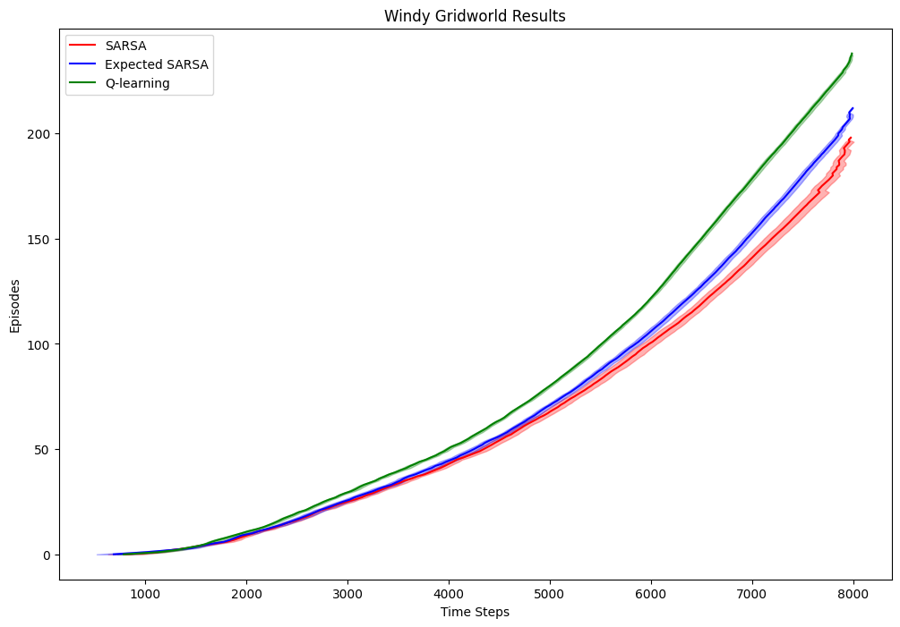

# ReinforcementLearning
Collection of activities I've done from Sutton and Barto's Reinforcement Learning 2nd Edition 

# Interesting Results
## EX1:
### 10-Armed Bandit using Epsilon-Greedy Algorithm with Incremental Update
Average Reward:

.png)

Optimal Action Percentage:

.png)

### Epsilon-Greedy Algorithm with optimistic initial values and the bandit algorithm with UCB action selection.
Average Reward:

Optimal Action Percentage:

.png)

## EX3:
### Solving Jacks Car Rental Problem with Policy Iteration
Normal Jack's Car Rental Problem:

Modified Jack's Car Rental Problem:

## EX4:
### Optimal Blackjack policy found using first-visit Monte-Carlo control with exploring starts (Monte-Carlo ES)
Non-Useable Ace:

Useable Ace:

## EX5:
### Comparing SARSA (on-policy TD control), Expected SARSA, and Q-learning (off-policy TD control) on Windy GridWorld

## EX6:
### Dyna Q on Blocked Maze (the path through the maze is blocked halfway through and a new opening appears).

Dyna Q on ShortCut Maze (a more optimal path opens halfway through).

